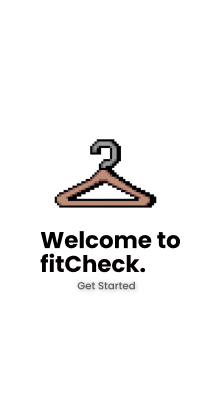
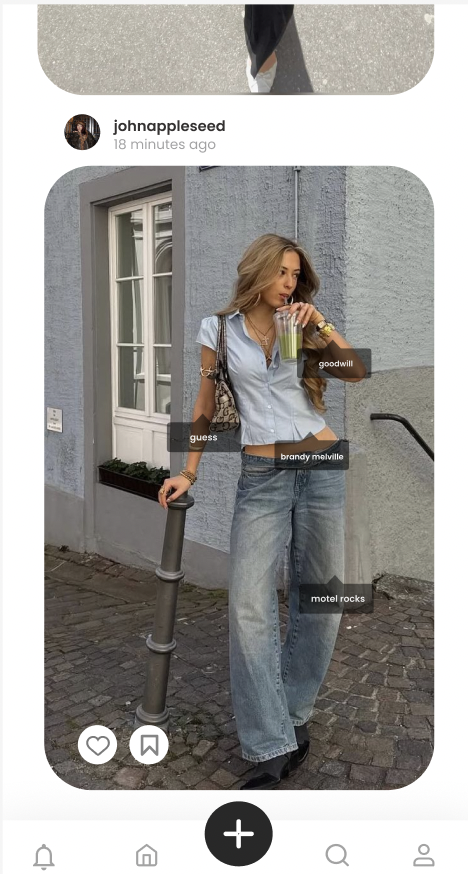
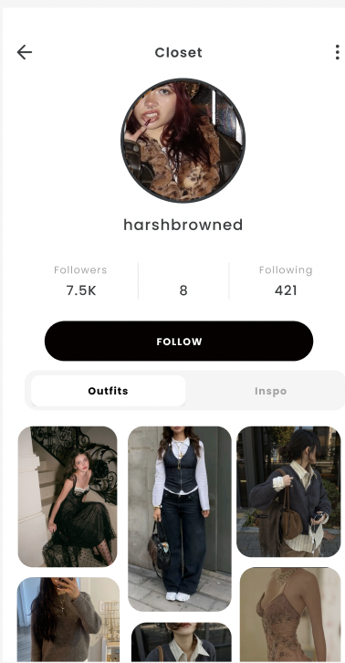

# FitCheck 👗

**FitCheck** is a full-stack mobile app designed to let users share, explore, and tag outfits in a social-first, visually engaging platform.

---
---

## Screenshots

  

    

---
## Key Features & Contributions

- **Full-Stack Development:** Designed and developed the app using **React Native**, **Firebase**, and **Expo**, enabling real-time social interactions and outfit discovery.  
- **Dynamic Content Discovery:** Implemented a **real-time post tagging and aesthetic search system** using Firestore queries for seamless feed navigation and personalized recommendations.  
- **Responsive UI/UX:** Engineered a **Masonry-style Explore feed** and profile pages optimized for mobile, supporting user-generated content and aesthetic categorization.  
- **Authentication & Data Management:** Integrated **Firebase Auth** and **Firestore** for secure user authentication, real-time data storage, and dynamic routing based on UID.  
- **Scalability & Engagement:** Built with scalability in mind, laying the foundation for **AI-driven outfit recommendations** and **interactive style challenges**.  

---

## Tech Stack

- **Frontend:** React Native, Expo  
- **Backend / Database:** Firebase (Firestore, Auth)  
- **Styling & Layout:** Responsive mobile-first design with Masonry feed layout  

